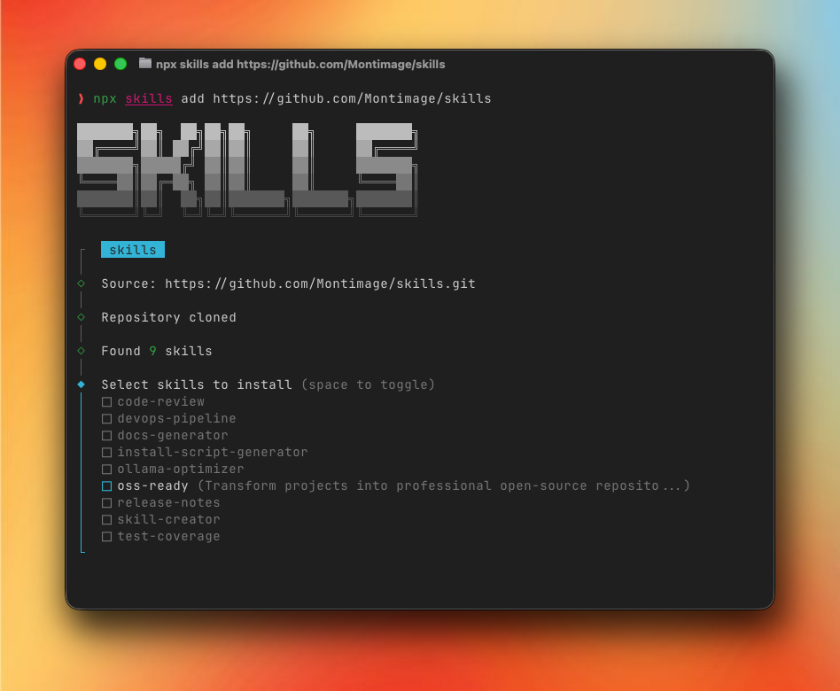

<p align="center">
  <picture>
    <source media="(prefers-color-scheme: dark)" srcset="assets/logo/logo-white.svg">
    <source media="(prefers-color-scheme: light)" srcset="assets/logo/logo-black.svg">
    
  </picture>
</p>

<p align="center">
  <a href="LICENSE"></a>
  <a href="#available-skills"></a>
</p>

A curated collection of Agent Skills by [Montimage](https://www.montimage.com/) that supercharge AI agents with specialized workflows, domain expertise, and reusable tooling for software development tasks. Works with Claude Code, Codex, OpenClaw, and other AI tools that support skill-based workflows.

## What Are Agent Skills?

Agent Skills are modular, self-contained packages that transform AI agents from general-purpose assistants into specialized tools. Each skill provides procedural knowledge, scripts, reference material, and templates for specific development workflows.

## Available Skills

| Skill | Description |
|-------|-------------|
| **[code-review](skills/code-review/)** | Code reviews following Code Smells and Pragmatic Programmer best practices |
| **[devops-pipeline](skills/devops-pipeline/)** | Pre-commit hooks and GitHub Actions for quality assurance |
| **[docs-generator](skills/docs-generator/)** | Restructure project documentation for clarity and accessibility |
| **[install-script-generator](skills/install-script-generator/)** | Cross-platform installation scripts with environment detection |
| **[ollama-optimizer](skills/ollama-optimizer/)** | Optimize Ollama configuration based on system hardware |
| **[oss-ready](skills/oss-ready/)** | Transform projects into professional open-source repositories |
| **[release-notes](skills/release-notes/)** | Generate release notes from git commits and GitHub PRs/issues |
| **[skill-creator](skills/skill-creator/)** | Guide for creating new Agent Skills |
| **[test-coverage](skills/test-coverage/)** | Expand unit test coverage by targeting untested branches and edge cases |

## Quick Start

### Installation

Install all skills with a single command:

```bash
npx skills add https://github.com/Montimage/skills
```

Or install a specific skill:

```bash
npx skills add https://github.com/Montimage/skills --skill code-review
npx skills add https://github.com/Montimage/skills --skill oss-ready
```

<p align="center">
  
</p>

### Usage

Once installed, skills are automatically detected by your AI agent. Simply describe what you need in natural language:

```
# Triggers the code-review skill
> Review my code for smells and quality issues

# Triggers the oss-ready skill
> Make this project open source ready

# Triggers the release-notes skill
> Generate release notes for the latest version
```

## Project Structure

```
skills/
├── skills/
│   ├── code-review/          # Code quality reviews
│   ├── devops-pipeline/      # CI/CD and pre-commit setup
│   ├── docs-generator/       # Documentation restructuring
│   ├── install-script-generator/  # Cross-platform installers
│   ├── ollama-optimizer/     # Local LLM optimization
│   ├── oss-ready/            # Open-source readiness
│   ├── release-notes/        # Changelog generation
│   ├── skill-creator/        # Skill authoring guide
│   └── test-coverage/        # Test coverage expansion
├── docs/                     # Project documentation
├── LICENSE                   # Apache 2.0
├── CONTRIBUTING.md           # Contribution guidelines
├── CODE_OF_CONDUCT.md        # Community standards
└── SECURITY.md               # Vulnerability reporting
```

## Skill Anatomy

Each skill follows a standard structure:

```
skill-name/
├── SKILL.md          # Required: metadata + instructions
├── scripts/          # Optional: executable code (Python/Bash)
├── references/       # Optional: domain knowledge, documentation
└── assets/           # Optional: templates, icons, fonts
```

The `SKILL.md` file contains YAML frontmatter (`name`, `version`, `description`) that the AI agent reads to determine when to activate the skill, plus markdown instructions loaded on activation.

## Contributing

We welcome contributions! Please see [CONTRIBUTING.md](CONTRIBUTING.md) for guidelines on:

- Adding new skills
- Improving existing skills
- Reporting bugs and requesting features

## License

This project is licensed under the Apache License 2.0 - see the [LICENSE](LICENSE) file for details.
