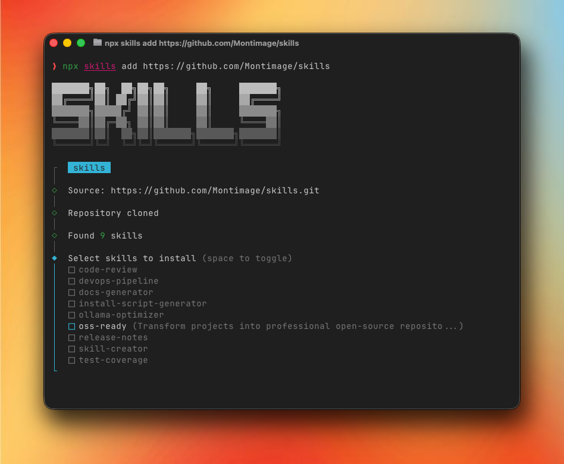

<p align="center">
  <picture>
    <source media="(prefers-color-scheme: dark)" srcset="assets/logo/logo-white.svg">
    <source media="(prefers-color-scheme: light)" srcset="assets/logo/logo-black.svg">
    
  </picture>
</p>

<p align="center">
  <a href="https://github.com/Montimage/skills/releases/tag/v1.1.0"></a>
  <a href="LICENSE"></a>
  <a href="#the-skills"></a>
  <a href="https://github.com/Montimage/skills/stargazers"></a>
</p>

<h1 align="center">Turn Your AI Agent Into a Senior Engineer</h1>

<p align="center">
10 plug-and-play skills that give Claude Code, Codex, and OpenClaw the domain expertise<br>to review code, ship releases, harden security, and optimize infrastructure — without you writing the prompts.
</p>

<p align="center">
  <a href="#get-started-in-30-seconds"><b>Get Started in 30 Seconds &rarr;</b></a>
</p>

---

## Your AI Agent Is Smart — But It Doesn't Know Your Workflow

You paste a task into Claude Code. It gives you a decent answer. But it doesn't know *how* your team reviews code, *what* your CI pipeline needs, or *which* tests are actually missing. So you end up:

- **Writing long prompts every time** — explaining the same review criteria, release process, or doc structure over and over
- **Fixing the AI's output** — generic code reviews miss your conventions, generated docs don't match your stack, CI configs need manual tweaking
- **Losing time on repetitive setup** — every new project needs the same OSS files, the same pre-commit hooks, the same install scripts

The more specialized the task, the more you're hand-holding the agent instead of shipping.

## Montimage Skills Fixes This in One Command

Each skill is a self-contained package of procedural knowledge — the exact steps, conventions, and scripts that a senior engineer would follow. Your AI agent loads the right skill automatically based on what you ask, then executes a structured workflow instead of improvising.

- **Code reviews that catch real issues** — not just lint warnings, but code smells, security holes, and Pragmatic Programmer violations, graded by severity
- **CI/CD pipelines that match your stack** — auto-detects your project type and generates pre-commit hooks + GitHub Actions, no YAML wrangling
- **Test coverage that finds the gaps** — identifies untested branches, error paths, and edge cases, then writes the missing tests
- **Release notes from your git history** — categorized changelogs pulled from commits, merged PRs, and closed issues
- **Documentation that makes sense** — analyzes your project and restructures docs into a coherent hierarchy with diagrams
- **Open-source readiness in minutes** — README, CONTRIBUTING, LICENSE, CODE_OF_CONDUCT, SECURITY, and GitHub templates, all generated to fit your project
- **Cross-platform install scripts** — environment detection, dependency checks, verification, and rollback — one command to generate
- **Local LLM optimization** — detects your GPU/RAM/CPU, classifies your hardware tier, and tunes Ollama for peak performance
- **Skill authoring** — a guided 4-phase process to create your own skills
- **Security auditing for skills** — scan any skill for prompt injection, credential leaks, and malicious patterns before you install it

## How It Works

1. **Install** — one command adds all 10 skills to your agent
   ```bash
   npx skills add https://github.com/Montimage/skills
   ```
2. **Ask naturally** — describe what you need in plain English
   ```
   > Review my code for smells and quality issues
   > Make this project open source ready
   > Generate release notes for the latest version
   ```
3. **The right skill activates** — your agent matches your request to the best skill and follows its structured workflow
4. **Get expert-level output** — severity-graded reports, production-ready configs, structured docs — not generic suggestions

<p align="center">
  
</p>

<p align="center">
  <a href="#get-started-in-30-seconds"><b>Start Shipping Faster &rarr;</b></a>
</p>

## The Skills

### Code Quality & Testing

| Skill | What It Does For You |
|-------|---------------------|
| **[code-review](skills/code-review/)** | Reviews code for smells, security issues, and Pragmatic Programmer violations — outputs severity-graded reports you can act on immediately |
| **[test-coverage](skills/test-coverage/)** | Finds untested branches, error paths, and edge cases, then generates the missing tests for your framework |

### DevOps & Releases

| Skill | What It Does For You |
|-------|---------------------|
| **[devops-pipeline](skills/devops-pipeline/)** | Auto-detects your stack and generates pre-commit hooks + GitHub Actions CI — no YAML from scratch |
| **[release-notes](skills/release-notes/)** | Produces categorized changelogs from git history, merged PRs, and closed issues |

### Documentation & Open Source

| Skill | What It Does For You |
|-------|---------------------|
| **[docs-generator](skills/docs-generator/)** | Analyzes your project and restructures documentation into a coherent hierarchy with Mermaid diagrams |
| **[oss-ready](skills/oss-ready/)** | Adds README, CONTRIBUTING, LICENSE, CODE_OF_CONDUCT, SECURITY, and GitHub templates — tailored to your project |

### Infrastructure & Optimization

| Skill | What It Does For You |
|-------|---------------------|
| **[install-script-generator](skills/install-script-generator/)** | Generates cross-platform install scripts with environment detection, verification, and rollback |
| **[ollama-optimizer](skills/ollama-optimizer/)** | Detects your hardware (GPU/RAM/CPU), classifies your tier, and optimizes Ollama for maximum inference speed |

### Skill Development

| Skill | What It Does For You |
|-------|---------------------|
| **[skill-creator](skills/skill-creator/)** | Walks you through a guided 4-phase skill creation: Discovery, Approval, Build, Test & Deliver |
| **[skill-auditor](skills/skill-auditor/)** | Scans skills for prompt injection, credential leaks, and malicious patterns before you install them |

## Get Started in 30 Seconds

Install all 10 skills:

```bash
npx skills add https://github.com/Montimage/skills
```

Or pick just the ones you need:

```bash
npx skills add https://github.com/Montimage/skills --skill code-review
npx skills add https://github.com/Montimage/skills --skill oss-ready
npx skills add https://github.com/Montimage/skills --skill test-coverage
```

Works with **Claude Code**, **Codex**, **OpenClaw**, and any AI tool that supports skill-based workflows.

## FAQ

**Is this free?**
Yes. Montimage Skills is open source under the [Apache 2.0 License](LICENSE) — free for personal and commercial use, forever.

**Which AI agents are supported?**
Claude Code, Codex, OpenClaw, and any agent that reads `SKILL.md` frontmatter for skill discovery. If your tool supports skills, these work.

**Is this actively maintained?**
Yes. v1.1.0 shipped March 2026 with expanded skill descriptions, security hardening, and repo-sync guardrails across all mutating skills. Check the [changelog](docs/CHANGELOG.md) for details.

**Can I use these in production workflows?**
Absolutely. Each skill follows a structured, repeatable workflow — no random improvisation. Skills like `code-review` and `test-coverage` are designed to integrate into your daily development loop.

**How do I create my own skill?**
Use the `skill-creator` skill. It walks you through a 4-phase process: Discovery, Approval, Build, Test & Deliver. Or follow the [Contributing guide](CONTRIBUTING.md).

**What if I find a security issue in a skill?**
Run `skill-auditor` on it first — it checks for prompt injection, credential leaks, and unrestricted shell commands. For reporting vulnerabilities in this project, see [SECURITY.md](SECURITY.md).

**How does this compare to writing my own prompts?**
Skills encode reusable procedural knowledge — the exact steps, checks, and conventions an expert would follow. You write the prompt once (as a skill), and every future invocation gets the same quality. No copy-pasting, no forgetting steps.

## Start Building Better With Your AI Agent

Montimage Skills gives your agent the expertise it's missing — structured workflows, security checks, and production-ready output for the tasks you do every day. Apache 2.0 licensed, free forever, installs in one command.

[**Install All 10 Skills Now &rarr;**](#get-started-in-30-seconds)

---

<details>
<summary><b>Project Structure</b></summary>

```
skills/
├── skills/                        # All agent skills
│   ├── code-review/               # Code quality reviews
│   ├── devops-pipeline/           # CI/CD and pre-commit setup
│   ├── docs-generator/            # Documentation restructuring
│   ├── install-script-generator/  # Cross-platform installers
│   ├── ollama-optimizer/          # Local LLM optimization
│   ├── oss-ready/                 # Open-source readiness
│   ├── release-notes/             # Changelog generation
│   ├── skill-auditor/             # Security audit for agent skills
│   ├── skill-creator/             # Skill authoring guide
│   └── test-coverage/             # Test coverage expansion
├── assets/                        # Logo and screenshot assets
├── docs/                          # Project documentation
│   ├── ARCHITECTURE.md            # System design and decisions
│   ├── CHANGELOG.md               # Version history
│   ├── DEPLOYMENT.md              # Publishing and distribution
│   └── DEVELOPMENT.md             # Local development setup
├── LICENSE                        # Apache 2.0
├── CONTRIBUTING.md                # Contribution guidelines
├── CODE_OF_CONDUCT.md             # Community standards
└── SECURITY.md                    # Vulnerability reporting
```

</details>

<details>
<summary><b>Skill Anatomy</b></summary>

Each skill follows a standard structure:

```
skill-name/
├── SKILL.md          # Required: metadata + instructions for the AI agent
├── README.md         # Required: human-readable documentation
├── scripts/          # Optional: executable code (Python/Bash)
├── references/       # Optional: domain knowledge, documentation
└── assets/           # Optional: templates, icons, fonts
```

The `SKILL.md` file contains YAML frontmatter (`name`, `version`, `description`) that the AI agent reads to determine when to activate the skill, plus markdown instructions loaded on activation. The `README.md` provides human-readable documentation with highlights, trigger phrases, workflow diagrams, and usage instructions.

Skills use a three-level progressive disclosure system:

1. **Metadata** (always in context) — `name` + `description` from YAML frontmatter (~100 words)
2. **Instructions** (on activation) — SKILL.md body loaded when the skill triggers (<5k words)
3. **Resources** (on demand) — scripts, references, and assets loaded as needed

</details>

<details>
<summary><b>Contributing</b></summary>

We welcome contributions! See [CONTRIBUTING.md](CONTRIBUTING.md) for full guidelines.

**Quick start:**

1. Fork the repository
2. Create a feature branch: `git checkout -b feat/your-feature-name`
3. Follow [Conventional Commits](https://www.conventionalcommits.org/): `feat:`, `fix:`, `docs:`
4. Test your skill with Claude Code before submitting
5. Open a Pull Request

**Adding a new skill:**

1. Create `skills/your-skill-name/SKILL.md` with proper YAML frontmatter
2. Follow the [skill-creator](skills/skill-creator/) guide for best practices
3. Update the skills table in this README

</details>

<details>
<summary><b>License</b></summary>

This project is licensed under the Apache License 2.0 — see the [LICENSE](LICENSE) file for details.

Copyright [Montimage](https://www.montimage.com/)

</details>
