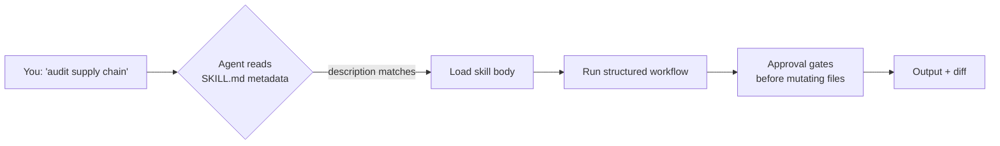
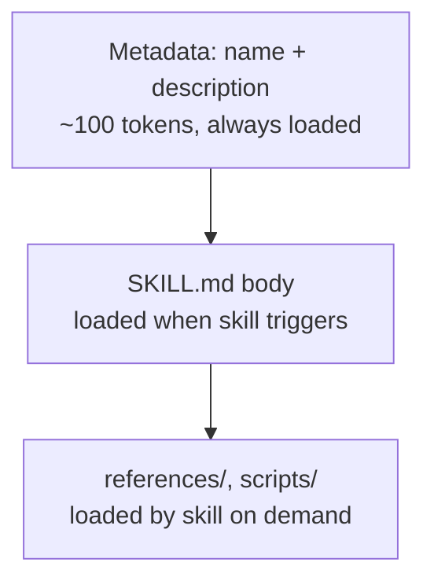

<p align="center">
  <picture>
    <source media="(prefers-color-scheme: dark)" srcset="assets/logo/logo-white.svg">
    <source media="(prefers-color-scheme: light)" srcset="assets/logo/logo-black.svg">
    
  </picture>
</p>

<p align="center">
  <a href="LICENSE"></a>
  <a href="#catalog"></a>
  <a href="https://github.com/Montimage/skills/stargazers"></a>
</p>

# Procedural skills your AI agent loads on demand

Nine `SKILL.md` packages for Claude Code, Codex, and any agent that reads
skill metadata. Each one encodes a structured workflow — what to check, in
what order, with what guardrails — so you stop re-explaining your process
every session.

```bash
npx skills add https://github.com/Montimage/skills
```

## Why use skills instead of prompts

You keep typing the same instructions: "review this PR but also check SQL
safety", "set up CI but use pnpm not npm", "make the branch cleanup
non-destructive". Prompts evaporate. The next session you write them again,
slightly differently, and your agent improvises.

A skill is the prompt frozen as code. Same trigger, same workflow, same
checks, every time.

## How it works


```mermaid
flowchart LR
    A[You: 'audit supply chain'] --> B{Agent reads<br/>SKILL.md metadata}
    B -->|description matches| C[Load skill body]
    C --> D[Run structured workflow]
    D --> E[Approval gates<br/>before mutating files]
    E --> F[Output + diff]
```

The agent matches your request against each skill's `description` field. The
chosen skill's body loads on demand, runs its workflow, and stops at human
approval gates before changing anything.

## Catalog

Find the skill by what you'd type. Every row is a working trigger phrase.

### Shipping and releases

| You say | Skill | Outcome |
|---|---|---|
| "review this branch" / "branch cleanup" | [branch-inspector](skills/branch-inspector/) | Per-branch diff/merge/staleness report, then you pick delete/archive/PR/keep |
| "set up CI" / "add pre-commit hooks" | [devops-pipeline](skills/devops-pipeline/) | Detects stack, generates pre-commit + GitHub Actions, no YAML from scratch |
| "create an installer" / "install on any OS" | [install-script-generator](skills/install-script-generator/) | One `curl \| sh` script with OS/arch detection, verify, rollback |

### Quality and security

| You say | Skill | Outcome |
|---|---|---|
| "audit supply chain" / "harden dependencies" | [supply-chain-audit](skills/supply-chain-audit/) | Detect→audit→plan→apply for npm/pip/Docker/Actions; approval gated |
| "add more tests" / "find untested code" | [test-coverage](skills/test-coverage/) | Lists untested branches and error paths, then writes the missing tests |
| "is this skill safe?" / "audit this skill" | [skill-auditor](skills/skill-auditor/) | Scans a third-party skill for prompt injection, creds, shell risks |

### Documentation and open source

| You say | Skill | Outcome |
|---|---|---|
| "the README is a mess" / "organize docs" | [docs-generator](skills/docs-generator/) | Restructures scattered docs into a hierarchy with Mermaid diagrams |
| "make this open source" / "OSS readiness" | [oss-ready](skills/oss-ready/) | Adds README/CONTRIBUTING/LICENSE/CoC/SECURITY + 8-section audit |
| "full OSS prep" / "open-source this repo" | [oss-ready-flow](skills/oss-ready-flow/) | End-to-end 6-step orchestrator (audit, cleanup, docs, README, publish) |

## Install

Install the whole pack:

```bash
npx skills add https://github.com/Montimage/skills
```

Or pick one:

```bash
npx skills add https://github.com/Montimage/skills --skill supply-chain-audit
```

Verify in Claude Code:

```bash
claude --list-skills | grep -E 'branch-inspector|supply-chain'
```

## Use it

The trigger phrases above are the API. Type them naturally:

```text
> Audit supply chain on this repo
> Inspect the branch feature/legacy-payment
> Make this project OSS-ready
```

The agent picks the matching skill from `description` metadata and runs it.

## Anatomy of a skill

```
supply-chain-audit/
├── SKILL.md          # YAML metadata + workflow instructions
├── references/       # Loaded on demand (per-ecosystem rules, templates)
├── scripts/          # Runnable helpers
├── evals/            # Test prompts + assertions
└── docs/             # Human-only (README, eval report)
```

Loading is progressive:


```mermaid
flowchart TD
    A[Metadata: name + description<br/>~100 tokens, always loaded] --> B
    B[SKILL.md body<br/>loaded when skill triggers] --> C
    C[references/, scripts/<br/>loaded by skill on demand]
```

Token cost stays low because only the matching skill's body enters context.

## FAQ

**Which agents work?** Claude Code, Codex, and any tool that reads `SKILL.md`
frontmatter. No agent-specific bindings.

**Free for commercial use?** Yes. Apache 2.0.

**How do I write my own?** Fork a skill and edit `SKILL.md`. The frontmatter
schema is documented in [CONTRIBUTING.md](CONTRIBUTING.md).

**What if a skill modifies my repo wrong?** Every mutating skill (oss-ready,
devops-pipeline, supply-chain-audit, etc.) gates writes behind explicit user
approval and prints a diff before applying.

**Security?** Run `skill-auditor` on any third-party skill before installing.
For vulnerabilities here, see [SECURITY.md](SECURITY.md).

<details>
<summary><b>Project layout</b></summary>

```
skills/
├── skills/                       # 9 skills, one per directory
├── assets/                       # Logo and screenshot assets
├── docs/                         # Project documentation
│   ├── ARCHITECTURE.md
│   ├── CHANGELOG.md
│   └── DEVELOPMENT.md
├── LICENSE                       # Apache 2.0
├── CONTRIBUTING.md
├── CODE_OF_CONDUCT.md
└── SECURITY.md
```

</details>

<details>
<summary><b>Skill anatomy and progressive disclosure</b></summary>

Each skill ships a `SKILL.md` with YAML frontmatter (`name`, `description`,
`version`) and a markdown body. The agent reads metadata first; on match it
loads the body; the body points to `references/` and `scripts/` as needed.

Three levels:

1. **Metadata** — `name` + `description`, always in context, ~100 tokens.
2. **Body** — `SKILL.md` markdown, loaded on activation, target ≤500 lines.
3. **Resources** — files under `references/` and `scripts/`, loaded by the
   skill body when it needs them.

This keeps the context window small even with dozens of installed skills.

</details>

<details>
<summary><b>Contributing</b></summary>

1. Fork.
2. `git checkout -b feat/your-skill-name`
3. Create `skills/your-skill-name/SKILL.md` with valid frontmatter.
4. Add `evals/evals.json` with 2–3 realistic prompts.
5. Conventional commits: `feat(your-skill): ...`
6. Open a PR.

See [CONTRIBUTING.md](CONTRIBUTING.md) for the full guide.

</details>

<details>
<summary><b>License</b></summary>

Apache 2.0. Copyright [Montimage](https://www.montimage.com/).

</details>
