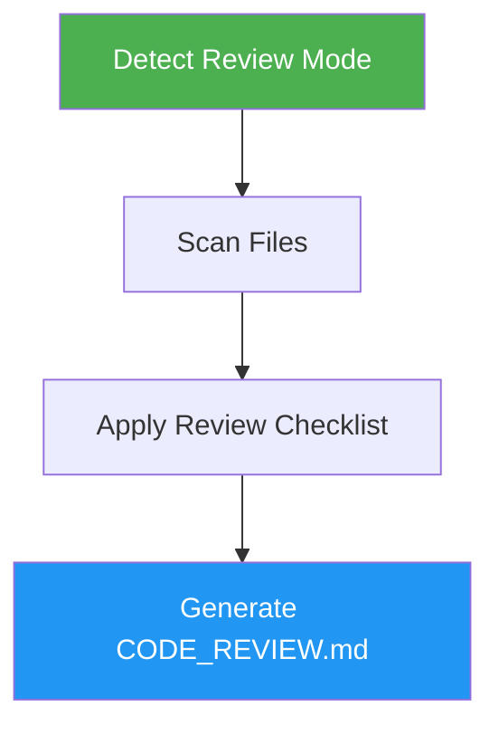

# Code Review

> Review code for quality issues, code smells, and pragmatic programming violations with structured severity-based reports.

## Highlights

- Detects code smells from the complete catalog (Bloaters, OO Abusers, Change Preventers, Dispensables, Couplers)
- Applies Pragmatic Programmer principles (DRY, Orthogonality, Broken Windows)
- Checks security vulnerabilities (SQL injection, XSS, hardcoded secrets)
- Supports both PR/diff reviews and full codebase audits
- Outputs structured markdown reports grouped by severity

## When to Use

| Say this... | Skill will... |
|---|---|
| "review this code" | Audit current codebase for code smells and issues |
| "check for code smells" | Scan for Bloaters, Couplers, Dispensables, and more |
| "review my PR" | Focus review on changed files in the PR diff |
| "audit the codebase" | Full codebase scan prioritizing entry points and hot files |

## How It Works



## Usage

```
/code-review
```

## Output

Generates a `CODE_REVIEW.md` report with a severity summary table, detailed findings grouped by Critical/Major/Minor/Info, before/after code examples, and prioritized recommendations.

## Resources

| Path | Description |
|---|---|
| `references/code-smells.md` | Complete catalog of code smells with examples |
