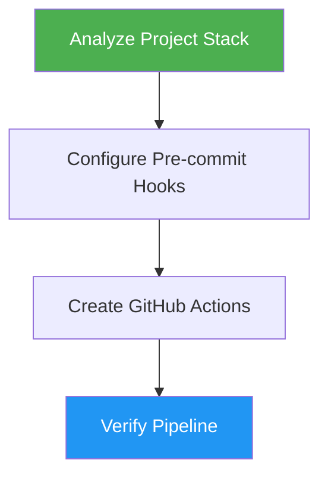

# DevOps Pipeline

> Implement pre-commit hooks and GitHub Actions for quality assurance, adapted to your project's tech stack.

## Highlights

- Auto-detects project languages, frameworks, and existing tooling
- Configures pre-commit hooks with language-appropriate tools
- Creates GitHub Actions CI workflows mirroring local checks
- Supports JS/TS, Python, Go, Rust, and Java ecosystems

## When to Use

| Say this... | Skill will... |
|---|---|
| "setup CI/CD" | Create pre-commit hooks and GitHub Actions workflows |
| "add pre-commit hooks" | Configure `.pre-commit-config.yaml` for your stack |
| "create GitHub Actions" | Generate `.github/workflows/ci.yml` with caching and matrix testing |
| "add linting to CI" | Set up formatters, linters, and security checks |

## How It Works



## Usage

```
/devops-pipeline
```

## Output

Creates `.pre-commit-config.yaml` and `.github/workflows/ci.yml` configured for the detected project stack with appropriate formatters, linters, type checkers, and security scanners.

## Resources

| Path | Description |
|---|---|
| `references/precommit-configs.md` | Pre-commit configurations by language |
| `references/github-actions.md` | GitHub Actions workflow templates |
