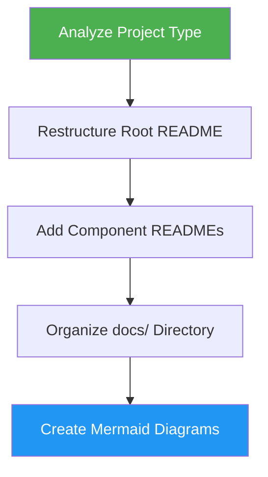

# Documentation Generator

> Restructure project documentation for clarity and accessibility with appropriate hierarchy for the project type.

## Highlights

- Analyzes project type (library, API, web app, CLI, microservices)
- Streamlines root README.md as an effective entry point
- Creates component-level READMEs per module/package/service
- Generates Mermaid diagrams for architecture and data flow
- Organizes docs/ directory by category

## When to Use

| Say this... | Skill will... |
|---|---|
| "organize docs" | Restructure scattered documentation into coherent hierarchy |
| "generate documentation" | Create docs/ structure with architecture, API, deployment guides |
| "improve doc structure" | Streamline README and add cross-referenced documentation |
| "restructure README" | Refine root README as project entry point with quickstart |

## How It Works



## Usage

```
/docs-generator
```

## Output

Creates a structured documentation hierarchy including a streamlined root README.md, component-level READMEs, and a `docs/` directory with architecture, API reference, deployment, development, and troubleshooting guides as applicable.
