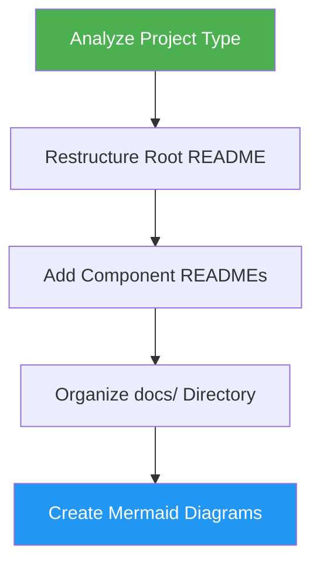

# Documentation Generator

> Restructure project documentation for clarity and accessibility with appropriate hierarchy for the project type.

## Highlights

- Analyzes project type (library, API, web app, CLI, microservices)
- Streamlines root README.md as an effective entry point
- Creates component-level READMEs per module/package/service
- Generates Mermaid diagrams for architecture and data flow
- Organizes docs/ directory by category with quality checklist

## When to Use

| Say this... | Skill will... |
|---|---|
| "generate documentation" | Create docs/ structure with architecture, API, deployment guides |
| "write docs for this project" | Analyze project and create full documentation hierarchy |
| "the README is a mess" | Restructure root README as clean entry point with quickstart |
| "document my code" | Generate component READMEs and centralized docs/ |
| "add API docs" | Create api-reference.md with endpoints and examples |

## How It Works


```mermaid
graph TD
    A["Analyze Project Type"] --> B["Restructure Root README"]
    B --> C["Add Component READMEs"]
    C --> D["Organize docs/ Directory"]
    D --> E["Create Mermaid Diagrams"]
    style A fill:#4CAF50,color:#fff
    style E fill:#2196F3,color:#fff
```

## Usage

```
/docs-generator
```

## Output

Creates a structured documentation hierarchy including a streamlined root README.md, component-level READMEs, and a `docs/` directory with architecture, API reference, deployment, development, and troubleshooting guides as applicable.
