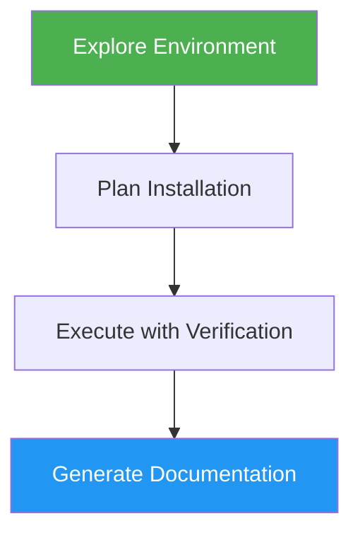

# Install Script Generator

> Generate cross-platform installation scripts with automatic environment detection, verification, and documentation.

## Highlights

- Detects OS, architecture, package managers, and existing dependencies
- Generates ordered installation plans with verification and rollback steps
- Executes installations with real-time verification and error handling
- Produces usage documentation and troubleshooting guides
- Supports Windows, Linux, and macOS

## When to Use

| Say this... | Skill will... |
|---|---|
| "create an installer for X" | Generate a full installation pipeline for software X |
| "automate installation" | Build verified install scripts with rollback support |
| "install X on any OS" | Create cross-platform installation with OS detection |
| "setup script for Node.js" | Detect environment, install Node.js, generate usage guide |

## How It Works



## Usage

```
/install-script-generator
```

## Output

Generates four files: `env_info.json` (system analysis), `installation_plan.yaml` (step-by-step plan), `install_report.md` (execution log), and `USAGE_GUIDE.md` (user documentation with quickstart and troubleshooting).

## Resources

| Path | Description |
|---|---|
| `scripts/env_explorer.py` | System environment detection script |
| `scripts/plan_generator.py` | Installation plan generator |
| `scripts/executor.py` | Plan executor with verification |
| `scripts/doc_generator.py` | Usage documentation generator |
