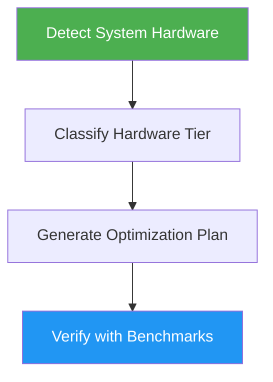

# Ollama Optimizer

> Optimize Ollama configuration for maximum performance based on system hardware analysis.

## Highlights

- Detects GPU, RAM, CPU, and existing Ollama configuration
- Classifies hardware into optimization tiers (CPU-only through High-end)
- Special handling for Apple Silicon unified memory
- Recommends models, quantization, and environment variables
- Provides benchmarking and verification commands

## When to Use

| Say this... | Skill will... |
|---|---|
| "optimize Ollama" | Analyze hardware and generate tailored optimization guide |
| "Ollama running slow" | Detect bottlenecks and recommend performance fixes |
| "setup local LLM" | Configure Ollama with optimal settings for your hardware |
| "tune LLM performance" | Adjust environment variables, model selection, and context size |

## How It Works



## Usage

```
/ollama-optimizer
```

## Output

Generates an `ollama-optimization-guide.md` with system overview, environment variable settings, model recommendations, Modelfile tuning parameters, an execution checklist, and verification commands.

## Resources

| Path | Description |
|---|---|
| `scripts/detect_system.py` | Hardware detection script |
| `scripts/benchmark_ollama.py` | Performance benchmarking script |
| `references/vram_requirements.md` | Model sizing and quantization guide |
| `references/environment_variables.md` | Complete env var reference |
| `references/platform_specific.md` | OS-specific setup guide |
