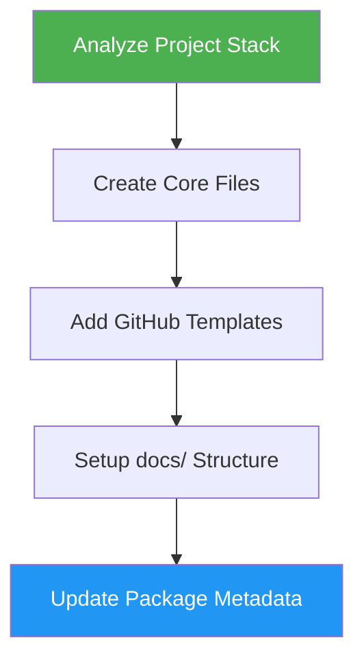

# OSS Ready

> Transform projects into professional open-source repositories with standard components and GitHub templates.

## Highlights

- Creates README, CONTRIBUTING, LICENSE, CODE_OF_CONDUCT, and SECURITY files
- Adds GitHub issue and PR templates
- Sets up documentation structure (architecture, development, deployment, changelog)
- Updates package metadata for the project's tech stack
- Preserves and enhances existing content

## When to Use

| Say this... | Skill will... |
|---|---|
| "make this open source" | Add all standard OSS files and templates |
| "add open source files" | Create LICENSE, CONTRIBUTING, CODE_OF_CONDUCT, SECURITY |
| "setup OSS standards" | Configure GitHub templates and documentation structure |
| "create contributing guide" | Generate CONTRIBUTING.md with dev setup, PR process, and standards |

## How It Works



## Usage

```
/oss-ready
```

## Output

Creates or updates: README.md, CONTRIBUTING.md, LICENSE (MIT default), CODE_OF_CONDUCT.md, SECURITY.md, GitHub issue/PR templates, and a `docs/` directory with architecture, development, deployment, and changelog files.

## Resources

| Path | Description |
|---|---|
| `assets/LICENSE-MIT` | MIT license template |
| `assets/CODE_OF_CONDUCT.md` | Contributor Covenant template |
| `assets/SECURITY.md` | Security policy template |
| `assets/.github/` | Issue and PR templates |
