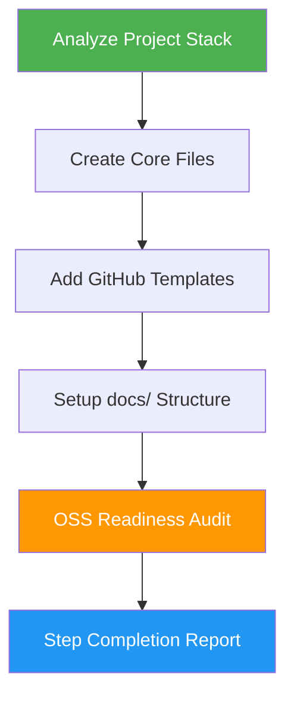

<!--
Human-facing docs for the oss-ready skill. AI agents: do not read this file when invoking the skill — read SKILL.md instead.
-->
# OSS Ready

> Transform projects into professional open-source repositories with standard components, GitHub templates, and an 8-section OSS readiness audit.

## Highlights

- Creates README, CONTRIBUTING, LICENSE, CODE_OF_CONDUCT, and SECURITY files
- Adds GitHub issue and PR templates
- Sets up documentation structure (architecture, development, deployment, changelog)
- Updates package metadata for the project's tech stack
- Runs an 8-section OSS readiness audit (license, cleanup, repo setup, docs, testing, GitHub policies, packaging, polish) plus bonus "great" items
- Drops a `docs/OSS_READINESS_CHECKLIST.md` into the target repo so maintainers can track progress
- Preserves and enhances existing content

## When to Use

| Say this... | Skill will... |
|---|---|
| "make this open source" | Add all standard OSS files and templates |
| "OSS readiness audit" | Run the 8-section checklist read-only and report status |
| "prepare for public release" | Full OSS readiness package + audit |
| "add open source files" | Create LICENSE, CONTRIBUTING, CODE_OF_CONDUCT, SECURITY |
| "setup GitHub templates" | Add issue templates and PR template |
| "create contributing guide" | Generate CONTRIBUTING.md with dev setup, PR process, and standards |

## How It Works



## Usage

```
/oss-ready
```

## Output

Creates or updates: `README.md`, `CONTRIBUTING.md`, `LICENSE` (MIT default), `CODE_OF_CONDUCT.md`, `SECURITY.md`, GitHub issue/PR templates, a `docs/` directory with architecture/development/deployment/changelog files, and a `docs/OSS_READINESS_CHECKLIST.md`. Ends with a per-section audit report listing what's done, what's missing, and the exact remediation step.

## Resources

| Path | Description |
|---|---|
| `assets/LICENSE-MIT` | MIT license template |
| `assets/CODE_OF_CONDUCT.md` | Contributor Covenant template |
| `assets/SECURITY.md` | Security policy template |
| `assets/OSS_READINESS_CHECKLIST.md` | Drop-in 8-section readiness checklist |
| `assets/.github/` | Issue and PR templates |
