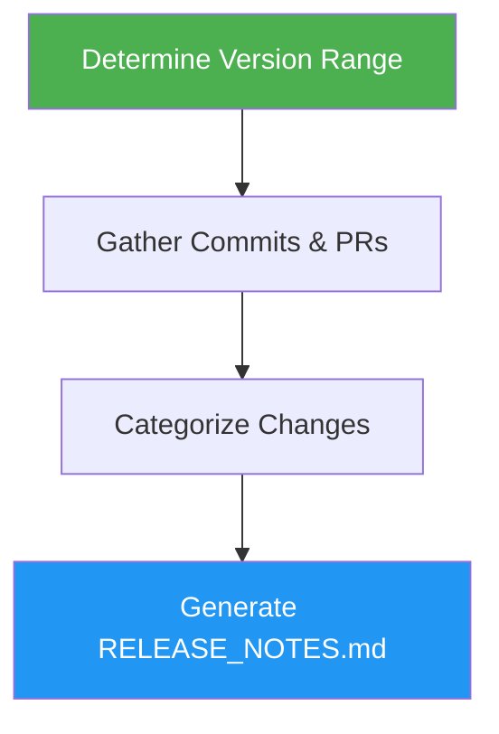

# Release Notes

> Generate comprehensive release notes from git commits, merged PRs, and closed issues.

## Highlights

- Analyzes git history between tags/releases
- Gathers merged PRs and closed issues from GitHub
- Categorizes changes by type (features, fixes, performance, breaking changes)
- Credits authors and highlights new contributors
- Optionally creates GitHub releases via `gh`

## When to Use

| Say this... | Skill will... |
|---|---|
| "create release notes" | Generate categorized notes from commit history and PRs |
| "generate changelog" | Produce a structured changelog between two versions |
| "prepare release" | Build release notes and optionally publish a GitHub release |
| "what changed since last release" | Summarize all changes since the latest tag |

## How It Works



## Usage

```
/release-notes
```

## Output

Generates `RELEASE_NOTES.md` with categorized sections (Breaking Changes, Features, Bug Fixes, Performance, Documentation, Other), author credits, new contributor highlights, and a full changelog link. Optionally creates a GitHub release.
