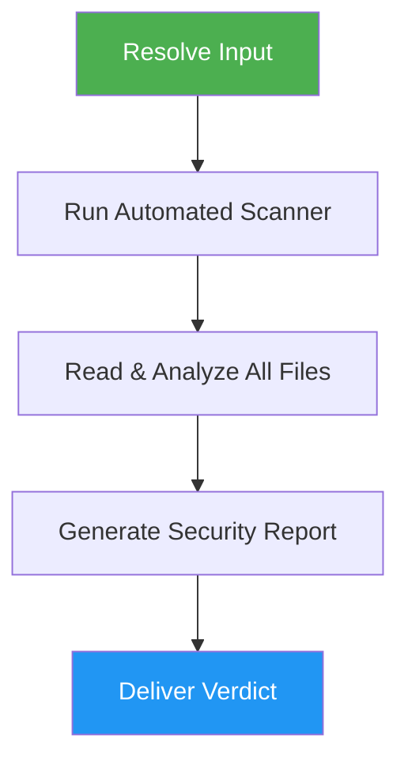

# Skill Auditor

> Analyze agent skills for security risks, malicious patterns, and potential dangers before installation.

## Highlights

- Scans for dangerous code patterns (shell commands, network calls, obfuscation, credential access)
- Detects prompt injection attempts hidden in skill files
- Supports local paths, GitHub URLs, and `npx skills add` commands as input
- Produces detailed security reports with contextual risk analysis
- Offers installation after safe verdicts

## When to Use

| Say this... | Skill will... |
|---|---|
| "audit a skill" | Run full security analysis on a skill directory |
| "is this skill safe?" | Scan for risks and deliver install/reject verdict |
| "npx skills add https://..." | Intercept install, audit first, then offer installation |
| "check skill security" | Analyze scripts, references, and instructions for threats |

## How It Works



## Usage

```
/skill-auditor
```

## Output

Generates `SKILL_AUDIT.md` with skill overview, risk summary table (9 categories), detailed findings with file:line references, files inventory, and a clear verdict (SAFE TO INSTALL / INSTALL WITH CAUTION / DO NOT INSTALL).

## Resources

| Path | Description |
|---|---|
| `scripts/scan_skill.py` | Automated pattern scanner |
| `references/security-checklist.md` | Full risk taxonomy and analysis guidelines |
