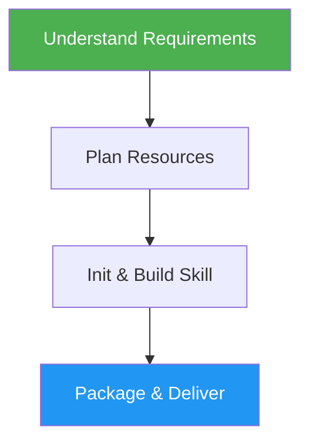

# Skill Creator

> Create new skills, modify existing skills, and package them for distribution.

## Highlights

- Six-phase guided process: Understand, Plan, Init, Edit, Package, Iterate
- Generates SKILL.md with proper frontmatter and progressive disclosure structure
- Creates bundled resources (scripts, references, assets) as needed
- Includes validation, testing, and packaging automation
- Supports updating existing skills with versioned changes

## When to Use

| Say this... | Skill will... |
|---|---|
| "create a new skill" | Guide through understanding, planning, building, and packaging |
| "build a skill for X" | Interactive creation with requirements gathering |
| "update this skill" | Read existing skill, propose changes, re-validate and re-package |
| "package this skill" | Validate and bundle into a distributable .skill file |
| "improve this skill" | Iterate on skill quality based on real usage feedback |

## How It Works


```mermaid
graph TD
    A["Understand Requirements"] --> B["Plan Resources"]
    B --> C["Init & Build Skill"]
    C --> D["Package & Deliver"]
    style A fill:#4CAF50,color:#fff
    style D fill:#2196F3,color:#fff
```

## Usage

```
/skill-creator
```

## Output

Creates a complete skill directory with SKILL.md (frontmatter + instructions), optional scripts/references/assets directories, and a packaged `.skill` file ready for distribution.

## Resources

| Path | Description |
|---|---|
| `scripts/init_skill.py` | Skill directory initializer |
| `scripts/quick_validate.py` | Structural validation script |
| `scripts/package_skill.py` | Skill packaging script |
| `references/workflows.md` | Multi-step workflow design patterns |
| `references/output-patterns.md` | Template and output quality patterns |
