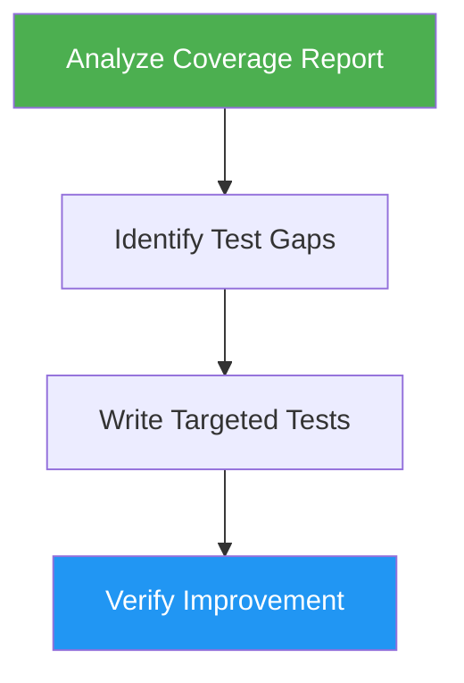

# Test Coverage

> Expand unit test coverage by targeting untested branches, edge cases, and error paths.

## Highlights

- Analyzes existing coverage reports to identify gaps
- Targets logical branches, error paths, and boundary values
- Adapts to the project's testing framework (Jest, pytest, Go testing, etc.)
- Follows existing test patterns and naming conventions
- Verifies measurable coverage improvement

## When to Use

| Say this... | Skill will... |
|---|---|
| "increase test coverage" | Identify gaps and write tests for untested code paths |
| "add more tests" | Generate tests for error handling, boundaries, and edge cases |
| "cover edge cases" | Write tests for null/empty inputs, min/max values, async issues |
| "improve test coverage" | Analyze coverage report, write tests, verify improvement |

## How It Works



## Usage

```
/test-coverage
```

## Output

Generates new test files or adds test cases to existing test files, targeting untested branches, error paths, boundary conditions, and edge cases. Confirms coverage improvement by re-running the coverage report.
